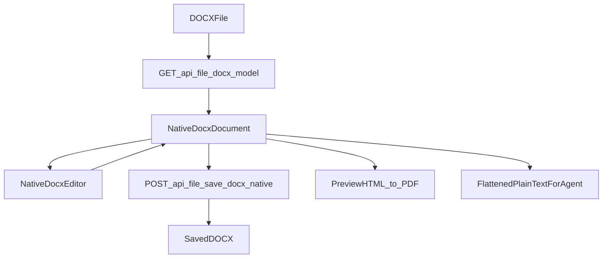

# Native DOCX Editor

This document explains the native DOCX editor path in the VAF Web UI, how it differs from the legacy HTML editor, and which parts of the system are responsible for loading, editing, exporting, and previewing DOCX files.

## Goal

The native DOCX editor exists to solve a core consistency problem:

- The document shown in the editor should match the saved document as closely as possible.
- DOCX editing must not depend on a lossy `DOCX -> HTML -> DOCX` roundtrip.
- PDF preview/export should come from the same document state as the editor.

## Why The Legacy Path Was Not Enough

The previous editor path for DOCX worked like this:

1. Convert `.docx` to simplified HTML in the backend.
2. Edit that HTML in the browser using `iframe + contentEditable + execCommand`.
3. Save a new `.docx` by parsing the edited HTML.

That approach was inherently lossy. It could not reliably preserve:

- paragraph and character styles
- run-level formatting
- lists and numbering definitions
- tables beyond simple text content
- images and anchors
- section/page settings
- headers and footers
- page breaks
- future OOXML features like footnotes or fields

## Current Architecture

The native editor is now `DOCX-first`.

## Main Components

### Backend

- `vaf/core/docx_native_model.py`
  - Canonical native DOCX document model used for import, edit state, and export.
- `vaf/core/docx_import.py`
  - Imports `.docx` into the native model.
- `vaf/core/docx_export.py`
  - Exports the native model back to `.docx`.
- `vaf/core/web_server.py`
  - Exposes the native editor endpoints:
  - `GET /api/file/docx-model`
  - `POST /api/file/save-docx-native`

### Frontend

- `web/lib/docxNative.ts`
  - TypeScript mirror of the native DOCX model plus helpers for flattening text and applying agent edits.
- `web/components/NativeDocxEditor.tsx`
  - The native DOCX editor UI used when the opened file is `.docx`.
- `web/components/DocumentEditor.tsx`
  - Dispatches to `NativeDocxEditor` for DOCX files and keeps the legacy HTML editor for other formats.
- `web/app/page.tsx`
  - Stores the per-session editor state, including the native DOCX model.

## Source Of Truth

For `.docx` files, the source of truth is no longer `innerHTML`.

It is now a structured `NativeDocxDocument` model with:

- sections
- header/footer content
- paragraphs
- runs
- tables
- images
- page breaks
- warnings for unsupported OOXML blocks

The editor view, DOCX save, and agent-facing text all derive from this same state.

## Current Feature Coverage

The native DOCX editor currently supports these concepts directly:

- paragraph styles
- run-level text with bold/italic/underline
- font family and font size
- bullet and numbered lists
- tables
- images
- headers and footers
- page breaks
- section properties at import/export level

Unsupported or partially supported OOXML content is not silently discarded in the editor model. Instead, it is represented as a warning or an `unsupported` block so the limitation is visible.

## Gotenberg's Role

Gotenberg is still important, but it is **not** the editing engine.

Gotenberg remains responsible for:

- high-fidelity Office-to-PDF conversion
- viewer-side Office preview
- future server-side print/preview workflows

Gotenberg is **not** used as the mutable editor state for DOCX editing.

## Agent Integration

The chat system still sends plain text from the open editor to the agent, but for native DOCX files this plain text is now derived from the native document model instead of browser HTML.

This means:

- the agent sees the current text content of the DOCX editor
- the editor remains model-driven internally
- `editor_apply_edit` can update the native document model for DOCX sessions
- marked selections can still be sent to the agent as explicit replacement ranges
- unmarked edits can target exact snippets from the current editor document

The agent does **not** receive the full OOXML structure in normal chat turns.

### Editing Modes For The Main Agent

The main agent now has two editor-write modes:

- `replace_editor_selection`
  - Use when the user has explicitly marked a region in the editor and wants that exact region replaced.
- `replace_editor_text`
  - Use when the user refers to a specific sentence or paragraph in the open editor document without marking it first.
  - The tool searches the current editor document for `old_text` and replaces the matching occurrence.

This allows prompts like:

- "Rewrite the marked section."
- "Please rewrite the paragraph that starts with 'Target sentence...'"

## Legacy Editor Split

The Web UI now has two editor paths:

### Native DOCX editor

Used for:

- `.docx`

Characteristics:

- model-driven
- direct DOCX import/export
- avoids HTML roundtrip for save

### Legacy HTML editor

Used for:

- `.html`
- `.htm`
- text-like formats and existing non-DOCX editor flows

Characteristics:

- `iframe + contentEditable`
- HTML-centric
- still valid for drafts and non-DOCX content

## Limits And Follow-Up Work

The native DOCX editor is a real architectural step, but not yet a full Word clone.

Future expansion areas:

- footnotes and endnotes
- fields and placeholders
- table merges and richer layout semantics
- section breaks and page setup editing in the UI
- richer image positioning
- TOC field support
- stronger roundtrip handling for complex foreign DOCX files

## Practical Rule For Future Changes

When working on the Document Editor:

- If the file is `.docx`, prefer the native DOCX model and native endpoints.
- Do not reintroduce HTML as the primary save format for DOCX.
- Treat Gotenberg as preview/render infrastructure, not as the editor state.
- Keep agent-facing text derived from the native model, not from browser-only markup.
