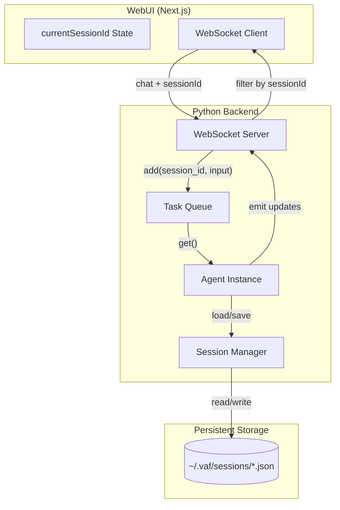

# VAF Session Management & Chat Synchronization

This document describes how VAF manages user sessions across TUI (Text UI), WebUI, and persistent storage.

---

## Architecture Overview



---

## Session ID Flow

### 1. Frontend → Backend (Sending Messages)

When user sends a chat message:

```typescript
// web/app/page.tsx (line 645-650)
ws.send(JSON.stringify({
    type: 'chat',
    content: textToSend,
    files: filesData,
    sessionId: currentSessionId  // CRITICAL: Must include session ID
}));
```

### 2. Backend Processing

```python
# vaf/core/web_server.py
# Priority: explicit message sessionId > connection sessionId > user-scoped fallback.
requested_session_id = cmd.get("sessionId")
connection_session_id = manager.get_session_for_connection(websocket)
session_id = requested_session_id or connection_session_id

# Safety: prevent implicit WebUI fallback into messenger sessions.
if (not requested_session_id) and isinstance(connection_session_id, str) and connection_session_id.startswith(("telegram_", "discord_", "whatsapp_")):
    session_id = None

if not session_id:
    safe_scope = str(manager.get_connection_user(websocket) or "default").replace("-", "")[:8]
    session_id = f"web-default-{safe_scope}"
```

### 3. Task Queue → Agent

For each task (chat or command), the runner calls `agent.load_session_context(task.session_id)` so the agent’s history and context match the task’s session. The queue now supports class-aware scheduling (`interactive`, `automation`, `background`) with optional weighted fairness; legacy single-queue behavior remains available by config. Example (conceptually):

```python
# vaf/core/headless_runner.py (chat task path)
task = tq.get()
agent.load_session_context(task.session_id)
# ... then process task.input_text (chat) or _handle_command (system command)
```

When the session is loaded, `SessionManager.load(session_id, restore_state=True)` restores `runtime_state` (including ContextManager: intent, state, narrative summary) from the session file, so the agent has the correct high-level context for that session.

### 3b. Session switch (Web UI)

When the user clicks a different session in the Web UI, the frontend sends `load_session` with the session id. The server loads the session from disk, sends `history_update` to the client, and enqueues a system command:

- **Command:** `__CMD__:LOAD_SESSION:{sid}` (with `session_id="system"` so the queue accepts it).
- **Handler:** In `vaf/core/headless_runner.py`, `_handle_command()` handles `LOAD_SESSION` by parsing the session id from the command and calling `agent.load_session_context(sid)`.

As a result, the agent’s context (history + ContextManager) is switched to the selected session immediately, even if the user does not send a new message. The next message in that session then runs with the correct session context already loaded.

### 4. Agent → Frontend (Broadcasting Updates)

```python
# vaf/core/web_interface.py
def _push_session_update(self, session_id: str, data: dict):
    if session_id:
        data['sessionId'] = session_id  # Tag message with session
    # ... broadcast via WebSocket
```

### 5. User isolation (multi-user)

- **Session list:** The backend filters sessions by the connection's `user_scope_id` (`SessionManager.list(..., user_scope_id=...)`). Users only see their own sessions and legacy sessions (no scope).
- **Load session:** Before subscribing to a session, the backend checks ownership: the session's `metadata.user_scope_id` must match the current user, or the user must be the local admin. Otherwise the server responds with `Access denied`.
- **Default session:** When no session is selected, the fallback session ID is per-user (`web-default-<scope>`), not a single global `web-default`.

### 6. Initial Session Bootstrap

On WebSocket connect, the backend sends a **user-filtered** `session_list` and immediately follows with
`history_update` for the first session in that list (or a newly created session for that user if the list is empty). The frontend should set
`currentSessionId` from that update so that `agent_message_update` is not filtered out.


```typescript
// web/app/page.tsx (line 278-283)
if (data.sessionId && activeSessionId && data.sessionId !== activeSessionId) {
    if (data.type !== 'session_list' && data.type !== 'history_update') {
        return;  // Reject messages for other sessions
    }
}
```

---

## Session ID Sources

| Location | Variable | Purpose |
|----------|----------|---------|
| Frontend State | `currentSessionId` | Currently selected session in UI |
| Frontend Ref | `currentSessionIdRef` | Stable reference for WebSocket callbacks |
| WebSocket Message | `data.sessionId` | Backend-specified session for each message |
| Connection Manager | `manager.get_session_for_connection()` | Per-WebSocket connection mapping |
| Agent Instance | `agent._session_id` | Agent's current context session |
| Session Manager | `current_session.id` | Active session being processed |

---

## Common Issues & Solutions

### Issue: WebUI Shows No Response

**Symptom:** TUI displays response, WebUI empty.

**Cause:** Session ID mismatch between frontend and backend.

**Fix:** Ensure frontend sends `sessionId` with every chat message.

---

### Issue: Messages Go to Wrong Session

**Symptom:** Response appears in different session than expected.

**Cause:** `agent._session_id` not synced after task queue processing.

**Fix:** After loading task from queue, sync agent session ID:
```python
agent._session_id = current_session.id
agent._register_session()
```

---

### Issue: Session Not Found

**Symptom:** Error loading session from storage.

**Cause:** WebUI created new session ID that doesn't exist in `~/.vaf/sessions/`.

**Fix:** Create session on-the-fly if not found:
```python
try:
    current_session = session_mgr.load(task.session_id)
except:
    current_session = session_mgr.new()
    current_session.id = task.session_id
    session_mgr.save(current_session)
```

---

## Session Storage Format

Sessions are stored as JSON in `~/.vaf/sessions/<session_id>.json`:

```json
{
    "id": "blue464411",
    "name": "Session 2026-01-27 05:30",
    "created_at": "2026-01-27T05:30:00.000Z",
    "updated_at": "2026-01-27T05:45:00.000Z",
    "model": "gpt-4o",
    "messages": [
        {"role": "user", "content": "Hey", "timestamp": "..."},
        {"role": "assistant", "content": "Hello!", "timestamp": "..."}
    ],
    "runtime_state": {}
}
```

---

## Debugging Session Issues

Enable debug logging:

```python
# vaf/core/web_interface.py (line 208)
print(f"[WebUI] Update: {data.get('type')} (sess: {session_id})")
```

```typescript
// web/app/page.tsx (line 280)
console.log(`🔍 [FILTER] Rejecting ${data.type}: backend=${data.sessionId}, frontend=${activeSessionId}`);
```

---

## Key Files

| File | Responsibility |
|------|----------------|
| `vaf/core/session.py` | Session data model, SessionManager class |
| `vaf/core/web_server.py` | WebSocket server, message routing |
| `vaf/core/web_interface.py` | Agent → WebUI broadcast manager |
| `vaf/cli/cmd/run.py` | CLI loop, task queue processing |
| `vaf/core/task_queue.py` | Queue policy, fairness, per-session in-flight guard |
| `web/app/page.tsx` | Frontend state, session filtering |

---

*Last updated: 2026-01-27*
