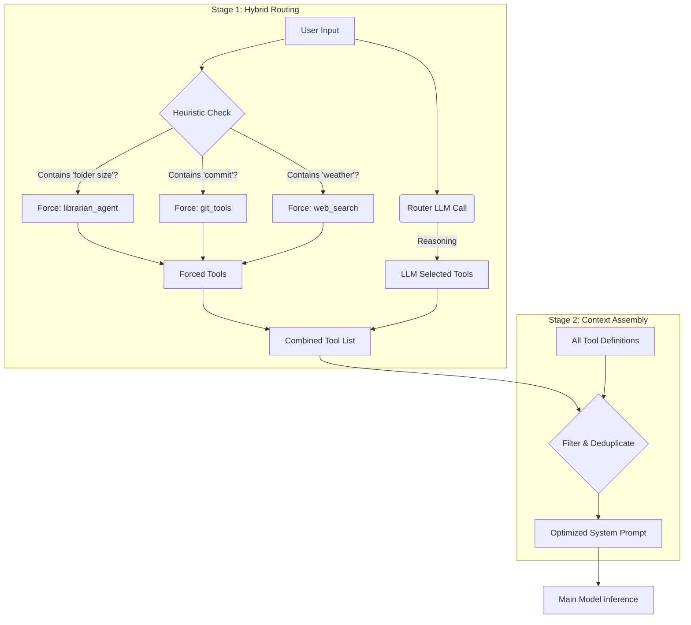

# Dynamic Tool Routing Architecture

This document details the **Dynamic Tool Router** and the three **Tool Calling 2.0** features of the Veyllo Agentic Framework (VAF). All features are **provider-agnostic** — they work with OpenAI, Anthropic, Google, local models, and OpenRouter without any provider-specific API extensions.

---

## 1. The Problem: Context Saturation

Modern agents often have access to dozens of tools (File System, Web Search, Git, Automation, Coding, etc.).

1. **Token Cost:** Defining a single tool in a JSON Schema (required for function calling) takes 150–500 tokens.
2. **Scale:** With 20+ tools, the definitions alone can consume 4,000+ tokens.
3. **Distraction:** Overloading the system prompt with irrelevant tools increases the chance of the model hallucinating tool calls or getting confused.

### The "Phantom Consumption"
Before the Router was implemented, the Agent had to reserve aggressive amounts of space for tools, often triggering "Proactive Compression" even when the conversation was short.

---

## 2. Tool Calling 2.0 — Three Provider-Agnostic Features

VAF implements all three concepts from Anthropic's "Advanced Tool Use" research, but in a **provider-agnostic** way so every backend benefits equally.

| Feature | Anthropic API variant | VAF provider-agnostic variant |
|---|---|---|
| **Tool Search** | `defer_loading: true` + tool search tool (beta) | Hybrid Router + `search_tools` tool |
| **Programmatic Tool Calling** | `code_execution` + `allowed_callers` (beta) | `python_sandbox(with_vaf_tools=True)` + `ToolBridgeServer` |
| **Tool Use Examples** | `input_examples` in tool JSON (beta) | `input_examples` embedded in description text |

---

## 3. Feature 1 — Tool Use Examples (`input_examples`)

### What it does
Every tool can optionally declare 1–3 concrete example calls. These are embedded as plain text into the tool's description so **every provider sees them** via the standard description field — no API change needed.

### How to add examples to a tool

```python
from vaf.tools.base import BaseTool

class MyTool(BaseTool):
    name = "my_tool"
    description = "Does something useful."
    input_examples = [
        {"query": "Berlin weather today"},
        {"query": "population of Tokyo", "language": "de"},
    ]
```

`BaseTool.get_description_with_examples()` renders this as:

```
Does something useful.

Examples:
  my_tool({"query": "Berlin weather today"})
  my_tool({"query": "population of Tokyo", "language": "de"})
```

### What the TOOLS property does with it

`agent.py`'s `TOOLS` property calls `get_description_with_examples()` instead of the raw `.description`. For small context windows (`n_ctx < 8000`) the truncation budget widens from 150 to 300 chars when examples are present so at least one example survives.

### Tools that already have examples

| Tool | Examples |
|---|---|
| `python_sandbox` | basic calc, `with_vaf_tools`, `packages` |
| `webfetch` | Python docs URL, GitHub repo |
| `send_mail` | plain email, email with attachment |
| `get_contact` | `name="Max"`, `name="Anna Müller"` |
| `search_tools` | calendar, whatsapp, read file |

To add examples to any other tool, just add the `input_examples` class attribute — no other changes needed.

---

## 4. Feature 2 — Tool Search (provider-agnostic)

### Hybrid Router (`_route_tools`)

VAF already solves the "load only relevant tools" problem without any Anthropic-specific API. The `_route_tools` method runs before every main model call:



**Heuristic keywords → forced tools:**

| Keywords | Forced tools |
|---|---|
| "folder size", "disk usage", "storage" | `librarian_agent` |
| "Google Drive", "OneDrive", "cloud" | `librarian_agent` |
| "calendar", "termin", "meeting", "event", "reminder" | `list_calendar_events`, `create_calendar_event` |
| "termin ändern", "reschedule" | `update_calendar_event` |
| "termin löschen", "cancel" | `delete_calendar_event` |
| "code", "script", "bug", "fix" | `coding_agent`, `git_status`, `git_add_commit` |
| "git", "commit", "push", "pull" | `git_status`, `git_add_commit`, `git_log` |
| "research", "recherche", "analyse" | `research_agent`, `web_search` |
| "search", "find", "news", "weather" | `web_search` |

### `search_tools` — on-demand discovery tool

In addition to the router, the model can itself call `search_tools` to discover tools it doesn't know about:

```
Model: search_tools(query="calendar appointment")
→ Returns:
    Tools matching 'calendar appointment':
      create_calendar_event: Create a new calendar event or appointment.
      list_calendar_events:  List upcoming events from the calendar.
      update_calendar_event: Modify an existing event.
```

**Scoring:** +2 per query token matching the tool name, +1 per token matching the description. Results capped at 10. If no matches, shows first 20 tools alphabetically with a "… and N more" trailer.

**Post-execution hook in `execute_tool()`:** After `search_tools` returns, the discovered tool names are immediately added to `_active_tools` so the model can call them in the very **next turn** without another router round-trip.

**Always available:** `search_tools` (and `list_tools`) are injected into every restricted tool set: the discovery-only fallback (router found no tools), CORE_TOOLS (tight context), and the emergency fallback list — so the model always has a discovery path.

**Tool cap (`router_max_tools`):** After the router selects tools (and core/discovery tools are added), the list is capped at `router_max_tools` (default: **12**). `list_tools` and `search_tools` are **always kept** and do not count against the cap. This prevents context pollution when many tools are registered.

```json
// ~/.vaf/config.json
{ "router_max_tools": 12 }
```

Range: 1–100. Raise it if agents report missing tools; lower it to reduce token overhead.

**Reasoning model compatibility:** When the router uses a reasoning model (DeepSeek Reasoner, R1) the tool selection often lands inside `<think>…</think>` blocks rather than in the response content. The parser strips think-tags first, then falls back to scanning the full raw response (including reasoning) for tool name substrings — so routing works correctly regardless of model type.

### `_active_tools` state machine

| Value | Meaning |
|---|---|
| `None` | Use ALL registered tools (router failure / retry / internal step) |
| `[list]` | Use only these tool names (normal operation, post-router) |

**Visibility in the Web UI:** The selected tools (e.g. `LLM-based: list_calendar_events` or `Script-based: web_search`) are shown in the chat as a Router system step so you can see which tools were chosen for each turn. See [WEB_UI.md](WEB_UI.md) → Workflow Steps / System Steps.

---

## 5. Feature 3 — Programmatic Tool Calling (`with_vaf_tools=True`)

### Concept

The model calls one tool (`python_sandbox`) with a code block that internally calls multiple other VAF tools. Only the **final `print()` output** of the script returns to the model context. Intermediate tool results are consumed entirely inside the running script — they never become chat messages.

This matches Anthropic's "Programmatic Tool Calling" semantics and works with **every backend**.

### Usage

```python
python_sandbox(
    code="""
import vaf_tools

# Call any VAF tool — results stay inside the script
weather = vaf_tools.call("web_search", {"query": "Berlin weather"})
contact = vaf_tools.call("get_contact", {"name": "Max"})

# Only this line reaches the model context
print(f"Weather: {weather[:200]}\nContact: {contact}")
""",
    with_vaf_tools=True,
)
```

To see all callable tools from inside the script:
```python
import vaf_tools
print(vaf_tools.available())
```

### Architecture

```
Host (VAF process)                          Docker sandbox
──────────────────────────────────────────  ──────────────────────────────
ToolBridgeServer (random port, daemon)  ←── vaf_tools.call("web_search", …)
  token check (per-execution secret)         HTTP POST /call  (JSON)
  → agent.execute_tool("web_search", …)      ← JSON {"result": "..."}
  → return str result                        script continues with result
                                             …
                                             print("final answer")  → model
```

**Files:**
- `vaf/core/tool_bridge.py` — `ToolBridgeServer` + `_BridgeHandler` + stub source
- `vaf/tools/python_sandbox.py` — `with_vaf_tools` parameter + `_run_with_bridge()`

### Security

| Property | Detail |
|---|---|
| Token | `secrets.token_hex(16)` per execution — rejected on mismatch (HTTP 403) |
| Binding | `0.0.0.0` on host, random free port — not exposed beyond local network |
| Trust gates | All calls go through `agent.execute_tool()` — full VAF gate pipeline applies |
| Cleanup | `bridge.stop()` in `finally` block — no port leak even on crash |

### Host gateway resolution

| OS | Bridge address |
|---|---|
| All | `host.docker.internal` (Docker Desktop on Mac/Win; `extra_hosts: host-gateway` injection on Linux via `docker-compose.memory.yml`) |

---

## 6. Context Consumption Analysis

### Without Router (legacy)
User: "What is the weather?"
- All 25+ tools in context → **~3,500–6,000 tokens**

### With Hybrid Router (current)
User: "What is the weather?"
1. Heuristic matches "weather" → forces `web_search`
2. Router LLM confirms `web_search`
3. Only `web_search` schema sent → **~200 tokens**

**Result:** >90% reduction in system prompt overhead.

---

## 7. Fallback Mechanisms

| Situation | Behaviour |
|---|---|
| Router LLM fails | `_active_tools = None` → ALL tools loaded (fail-safe) |
| Router returns empty | Context OK: discovery-only (`list_tools`, `search_tools`). Context tight (e.g. >75%): CORE_TOOLS subset. |
| Main model retry | `_active_tools = None` → full tool reload |
| Emergency (internal step) | Context >80%: minimal subset (`web_search`, `memory_search`, `list_tools`, `search_tools`, …) |

**CORE_TOOLS** (used when context is tight and router returns nothing):
`web_search`, `memory_search`, `memory_save`, `list_tools`, `search_tools`,
`update_intent`, `update_working_memory`, `read_file`, `list_files`,
`coding_agent`, `librarian_agent`, `research_agent`

---

## 8. Tool-use debug log (user-scope isolation)

When **Debug Logs** are enabled (Advanced → Debug Logs), each tool execution is written to `logs/tool_use_YYYY-MM-DD.log` with:

- `tool` — tool name
- `session_id` — current chat session ID
- `user_scope_id` — user-scope UUID used for RAG/memory isolation (may be empty on local/single-user)
- `args_preview` — truncated arguments (first 200 chars)

Use this to verify which user scope UUID is used for each tool call when debugging local vs multi-user or isolation issues. Log files are dated and cleaned by the garbage collector like other app logs.

---

## 9. Declarative Tool Contract

VAF tools declare a centralized contract directly on the class. All fields have safe defaults so they're opt-in, but every tool should set them explicitly for clarity.

### Fields

| Field | Type | Default | Description |
|---|---|---|---|
| `permission_level` | `"read"` \| `"write"` \| `"dangerous"` \| `"system"` | `"read"` | Access level. `dangerous` → confirmation gate. `system` → skips the legacy confirmation gate entirely (for internal/agent tools where prompting would be disruptive). For the **main agent**, `write`/`dangerous` (except `python_sandbox`) also require a plan in working memory before running — see the plan gate in [CONTEXT_MANAGEMENT.md](CONTEXT_MANAGEMENT.md). |
| `side_effect_class` | `"none"` \| `"reversible"` \| `"irreversible"` | `"none"` | Impact of the tool. Added to the confirmation message when `dangerous`. |
| `admin_only` | `bool` | `False` | When `True`, the tool is **hard-blocked** for non-admin users at the `execute_tool()` level. The check uses `_current_user_role` and `_current_user_scope_id` (both set on the agent before each turn). This is a role-based check — distinct from `channel_restrictions` which is source-based. |
| `channel_restrictions` | `tuple[str, ...]` | `()` | Sources where the tool is blocked. Common values: `"telegram"`, `"whatsapp"`, `"discord"`, `"channel"` (generic chat). |

### Evaluation order in `execute_tool()`

1. **`admin_only` check** — if `admin_only == True` and the current user is not an admin, the tool is hard-blocked. `is_admin` is derived from `_current_user_role` and `_current_user_scope_id` on the agent instance.
2. **Channel check** — if the session source is in `channel_restrictions`, the tool is rejected immediately (regardless of user role).
3. **Plan gate (main agent only)** — for `write`/`dangerous` tools (except `python_sandbox`), if no plan exists in working memory the call is blocked with a `[PLAN REQUIRED]` message asking the agent to write a short plan first; satisfied in the same turn, with a loop-cap escape so it never hard-locks. Skipped for sub-agents and non-interactive runs. See [CONTEXT_MANAGEMENT.md](CONTEXT_MANAGEMENT.md).
4. **Permission gate** — if `permission_level == "dangerous"`, the user is prompted (once / always / cancel). `side_effect_class == "irreversible"` adds a warning line to the prompt.
5. **`permission_level == "system"`** — bypasses the legacy confirmation gate entirely. Previously documented but never evaluated; now implemented.
6. **Legacy trust gates** — existing risky-tool checks run as fallback for tools that predate the contract system.

### Examples

```python
# Read-only, safe everywhere
class GetContactTool(BaseTool):
    permission_level  = "read"
    side_effect_class = "none"
    channel_restrictions = ()
    admin_only = False

# Writes to external service, blocked on chat channels
class SendMailTool(BaseTool):
    permission_level  = "write"
    side_effect_class = "irreversible"
    channel_restrictions = ("telegram", "whatsapp")
    admin_only = False

# Dangerous — user must confirm; cannot be undone
class DeleteFileTool(BaseTool):
    permission_level  = "dangerous"
    side_effect_class = "irreversible"
    channel_restrictions = ("telegram", "whatsapp", "discord")
    admin_only = False

# Admin-only, internal — only available in admin sessions, no confirmation gate
class CreateAgentToolTool(BaseTool):
    permission_level  = "system"    # skips confirmation gate
    side_effect_class = "reversible"
    channel_restrictions = ("telegram", "whatsapp", "discord")
    admin_only = True               # hard-blocked for regular users
```

### `admin_only` vs `channel_restrictions` — key distinction

| | `channel_restrictions` | `admin_only` |
|---|---|---|
| Blocks based on | Chat *source* (telegram, web, …) | User *role* (admin vs user) |
| Admin affected? | Yes — admins on Telegram are also blocked | No — admins always pass |
| Use case | Prevent tool abuse via messaging bots | Restrict to elevated-trust sessions |

---

## 10. `coder_only` — Restricting Tools to the Coder Sub-Agent

Set `coder_only = True` on any tool that should **only** be available to the Coding Sub-Agent (`coder.py`), not to the Main Agent.

```python
class BashTool(BaseTool):
    coder_only = True   # Excluded from Main Agent tool list
```

**Tools currently marked `coder_only`:**

| Tool | Reason |
|---|---|
| `bash` | Raw shell — Main Agent delegates to Coder instead |
| `batch` | Low-level batching — Coder-specific |
| `codesearch` | Code-aware search — Coder-specific |
| `linter` | Linting — Coder-specific |
| `context_tools` | Internal Coder context management |

The Main Agent's `_load_tools()` skips any tool with `coder_only = True`. The Coder loads them separately from `vaf/tools/`.

---

## 11. `query_llm()` — Making LLM Calls Inside a Tool

`BaseTool` provides a built-in helper for tools that need to call the LLM internally (e.g. to summarize, classify, or generate content as part of their logic):

```python
def run(self, **kwargs) -> str:
    messages = [{"role": "user", "content": "Summarize: " + kwargs.get("text", "")}]
    return self.query_llm(messages, max_tokens=512, temperature=0.3)
```

### What `query_llm()` does internally

1. **Provider detection** — reads the active provider (`openai`, `anthropic`, `google`, `local`, …).
2. **Model resolution** — selects the correct model ID for that provider (e.g. `gpt-4o` vs `claude-sonnet-4-6`).
3. **API backend** — if `use_api_backend=True`, streams the response and returns the full text.
4. **Self-healing** — on HTTP 400/404, retries with a fallback model automatically.
5. **Local server fallback** — if no API key is configured, hits the local OpenAI-compatible endpoint.

Use `query_llm()` instead of calling provider SDKs directly — it stays provider-agnostic and inherits the agent's current model configuration automatically.

---

## 12. Related: Whare Wananga (tool self-learning) & the Action Tag

Two adjacent systems build on the tool layer described here:

- **Whare Wananga** ([WHARE_WANANGA.md](WHARE_WANANGA.md)) learns per-tool `tool_knowledge`.
  The Settings tools list (`tools_list`) now carries three extra per-tool fields, attached
  server-side in `_attach_learned_states`:
  - `learned_state` — `unlearned` / `learning` / `learned` / `stale`;
  - `requires_config` + `configured` — whether the tool depends on a connection and whether
    that connection is set up (resolved in `vaf/whare_wananga/preconditions.py` from the
    existing `telegram_config` / `discord_config` / `whatsapp_config` / `email_config`).

  The Declarative Tool Contract's `side_effect_class` (Section 9) is also the basis for
  Whare Wananga's safety gating (probe-safe read-only tools vs side-effecting ones, which
  may only be learned via the error/validation path).

  After the router scopes the turn's tools (`_active_tools`), Whare Wananga's **delivery** appends
  each selected tool's learned pitfalls to its schema description (proactive), and re-feeds a failed
  tool's know-how on error (reactive) — see [WHARE_WANANGA.md](WHARE_WANANGA.md) "Delivery".
- **Action Tag** ([ACTION_TAG.md](ACTION_TAG.md)) — the agent declares the tool it is about
  to use; a backend parser matches that intent against the loaded tool list.
