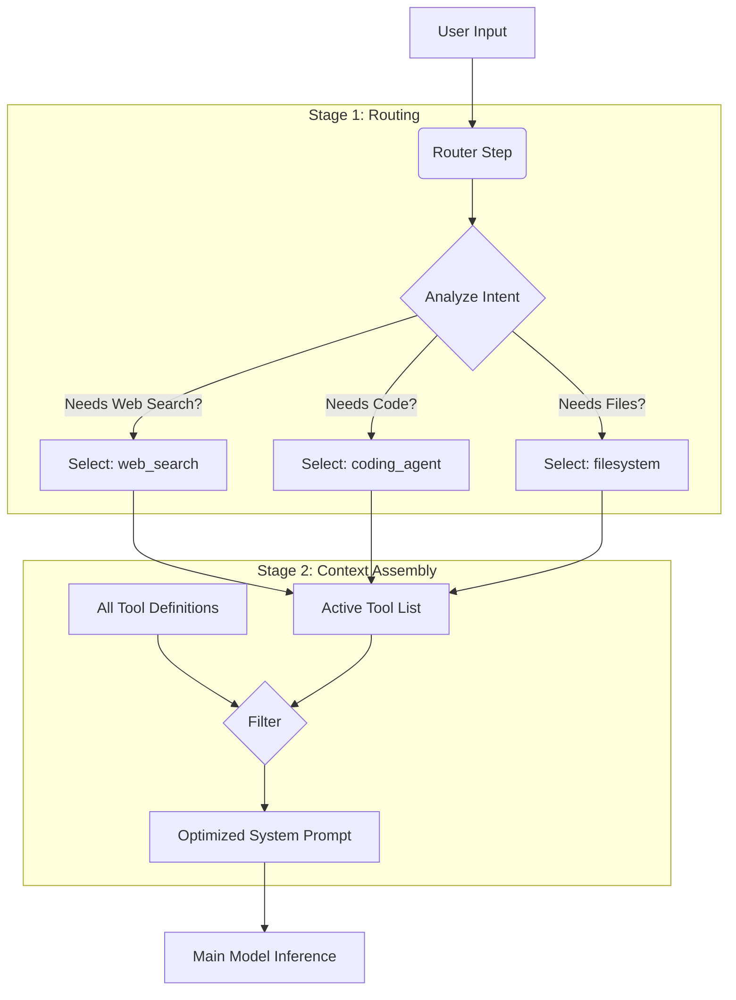

# Dynamic Tool Routing Architecture

This document details the **Dynamic Tool Router**, a core architectural component of the Veyllo Agentic Framework (VAF). The router solves the "Context Window Bottleneck" by dynamically selecting only the relevant tools for a specific user query, rather than loading the entire toolset definition into the context.

## 1. The Problem: Context Saturation

Modern agents often have access to dozens of tools (File System, Web Search, Git, Automation, Coding, etc.). 

1.  **Token Cost:** Defining a single tool in a JSON Schema (required for function calling) takes 150-500 tokens.
2.  **Scale:** With 20+ tools, the definitions alone can consume 4,000+ tokens.
3.  **Distraction:** Overloading the system prompt with irrelevant tools increases the chance of the model hallucinating tool calls or getting confused.

### The "Phantom Consumption"
Before the Router was implemented, the Agent had to reserve aggressive amounts of space for tools, often triggering "Proactive Compression" even when the conversation was short.

## 2. The Solution: Two-Stage Inference

VAF employs a **Two-Stage Inference** pattern. Before the Main Agent "sees" the user's message, a lightweight "Router" step analyzes the intent and selects the necessary tools.

### Architecture Diagram



## 3. Implementation Detail

The logic resides primarily in `vaf/core/agent.py`.

### 3.1. The Routing Logic (`_route_tools`)

This method performs the "Shadow Call"—a fast, low-temperature LLM call designed purely for classification.

**Source:** `vaf/core/agent.py`

```python
def _route_tools(self, user_input: str) -> List[str]:
    """
    Uses a preliminary LLM call to select the most relevant tools for a given user input.
    This helps to reduce the number of tool schemas loaded into the main context.
    """
    if not self.tools:
        return []

    # 1. Create a simplified list of tools (Name + Description only)
    # Optimization: We do NOT send the full JSON schema here, saving ~90% tokens.
    tool_info = []
    for name, tool_instance in self.tools.items():
        description = getattr(tool_instance, 'description', 'No description available.')
        tool_info.append(f"- {name}: {description}")
    
    tool_list_str = "\n".join(tool_info)

    # 2. Build the prompt for the router
    # Note context: We ask for a comma-separated list for easy parsing.
    prompt = (
        f"You are a tool router. Your only job is to select the most relevant tools for the user's request from the following list.\n"
        f"Respond with a comma-separated list of tool names only. Do not add any explanation.\n\n"
        f"Available Tools:\n{tool_list_str}\n\n"
        f"User Request: \"{user_input}\"\n\n"
        f"Relevant Tools (comma-separated):"
    )

    # 3. Make a lightweight LLM call
    # We use a very low temperature (0.1) to ensure deterministic output.
    messages = [{"role": "user", "content": prompt}]
    selected_tools_str = ""
    
    # ... (API/Local call logic) ...

    # 4. Parse the response
    tool_names = [name.strip() for name in selected_tools_str.split(',') if name.strip()]
    
    # Validation: Ensure we only enable tools that actually exist
    valid_tools = [name for name in tool_names if name in self.tools]
    
    return valid_tools
```

### 3.2. Integration in the Chat Loop

The router is invoked in `chat_step` before the main conversation history is processed.

**Source:** `vaf/core/agent.py`

```python
# Dynamic Tool Selection
# Only route tools on a new, non-empty input
if not auto_retry and not skip_input and user_input:
    self._active_tools = self._route_tools(user_input)
    if self._active_tools:
        UI.event("System", f"Tool Router selected: {', '.join(self._active_tools)}", style="dim")
else:
    # On retries or internal steps (where context might be complex), 
    # we default to allowing all tools to prevent errors.
    self._active_tools = None
```

### 3.3. Dynamic Schema Generation (`TOOLS` Property)

The `TOOLS` property is the critical interface that the Model backend (OpenAI/Anthropic/Local) reads to get the JSON schemas. It now respects the router's decision.

**Source:** `vaf/core/agent.py`

```python
@property
def TOOLS(self):
    """Dynamic Tool Schema Generation with Context-Aware Optimization"""
    schema = []
    n_ctx = self.config.get("n_ctx", 8192)
    is_small_context = n_ctx < 8000

    # STRATEGY: Use active tools if available, otherwise fallback to all tools
    tools_to_use = self._active_tools if self._active_tools is not None else self.tools.keys()

    for name in tools_to_use:
        if name not in self.tools:
            continue
        tool = self.tools[name]
        
        description = tool.description
        
        # Context Optimization: Truncate descriptions for small contexts
        if is_small_context and description and len(description) > 150:
            description = description[:147] + "..."
        
        schema.append({
            "type": "function",
            "function": {
                "name": name,
                "description": description,
                # Parameters are the heaviest part of the schema
                "parameters": getattr(tool, "parameters", {"type": "object", "properties": {}})
            }
        })
    return schema
```

## 4. Context Consumption Analysis

### Without Router (Legacy)
User Input: "What is the weather?"
1. **Load:** Automation Tool Schema (300 tokens)
2. **Load:** Git Tool Schema (250 tokens)
3. **Load:** Coder Tool Schema (400 tokens)
4. **Load:** Web Search Schema (200 tokens)
5. **Load:** ... (15 other tools)
**Total Overhead:** ~3500 Tokens active.

### With Router (Current)
User Input: "What is the weather?"
1. **Router Call:** Input: "Weather", List: "web_search, git...", Output: "web_search". (Cost: ~100 tokens, momentary).
2. **Main Call Load:**
    - Web Search Schema (200 tokens)
**Total Overhead:** ~200 Tokens active.

**Result:** >90% Reduction in System Prompt overhead for simple queries.

## 5. Fallback Mechanisms

The router is designed to fail gracefully.

1.  **Router Failure:** If the Router LLM call fails (network error, parsing error), `_route_tools` returns `list(self.tools.keys())`. This enables ALL tools, ensuring functionality over optimization.
2.  **Retries:** If the Main Agent produces an empty response or requests a retry, `self._active_tools` is set to `None`, forcing a full tool reload. This prevents the router from accidentally excluding a tool that might be needed for a complex correction.