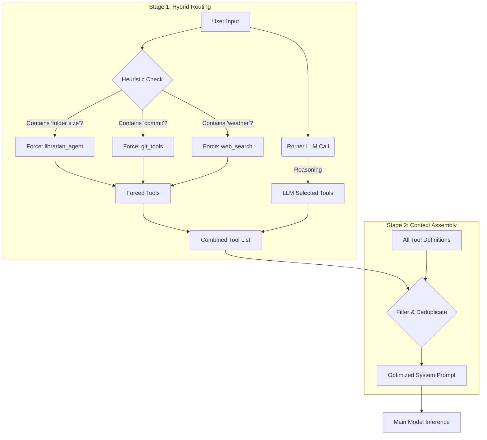

# Dynamic Tool Routing Architecture

This document details the **Dynamic Tool Router**, a core architectural component of the Veyllo Agentic Framework (VAF). The router solves the "Context Window Bottleneck" by dynamically selecting only the relevant tools for a specific user query, rather than loading the entire toolset definition into the context.

## 1. The Problem: Context Saturation

Modern agents often have access to dozens of tools (File System, Web Search, Git, Automation, Coding, etc.). 

1.  **Token Cost:** Defining a single tool in a JSON Schema (required for function calling) takes 150-500 tokens.
2.  **Scale:** With 20+ tools, the definitions alone can consume 4,000+ tokens.
3.  **Distraction:** Overloading the system prompt with irrelevant tools increases the chance of the model hallucinating tool calls or getting confused.

### The "Phantom Consumption"
Before the Router was implemented, the Agent had to reserve aggressive amounts of space for tools, often triggering "Proactive Compression" even when the conversation was short.

## 2. The Solution: Hybrid Routing (Heuristic + LLM)

VAF employs a **Hybrid Two-Stage Inference** pattern. It combines deterministic keyword matching (fast, robust) with probabilistic LLM reasoning (smart, flexible).

### Architecture Diagram



## 3. Implementation Detail

The logic resides primarily in `vaf/core/agent.py`.

### 3.1. Heuristic Pre-Selection (The "Safety Net")

To prevent the small Router LLM from missing obvious intents (e.g., overlooking the `librarian_agent` for "how full is my disk"), we enforce specific tools based on keywords.

**Keywords & Forced Tools:**
- **Filesystem:** "folder size", "disk usage", "how big", "storage", "read", "write" → `librarian_agent`
- **Cloud Storage:** "Google Drive", "OneDrive", "cloud", "Drive durchsuchen" → `librarian_agent` (has `cloud_storage` tool for browse/read/download)
- **Calendar:** "calendar", "kalender", "event", "termin", "meeting", "reminder", "erinnerung", "appointment", "verabredung", "schedule", "termine", "was steht an", "upcoming", "meine termine" → `list_calendar_events`, `create_calendar_event`
- **Automation:** "automate", "schedule", "daily", "weekly" → `create_automation`
- **Coding:** "code", "script", "app", "website", "fix", "bug" → `coding_agent`, `git_status`, `git_add_commit`
- **Git:** "git", "commit", "push", "pull" → `git_status`, `git_add_commit`, `git_log`
- **Research:** "research", "recherche", "analyse", "deep" → `research_agent`, `web_search`
- **Web Search:** "search", "find", "news", "weather", "wetter" → `web_search`

When `web_search` is used, results are fetched in this order if configured: Brave Search API, then Google Custom Search API, then scrape Google, then DuckDuckGo. See [API_INTEGRATION.md](API_INTEGRATION.md#web-search-api-keys) for config keys.

### 3.2. The LLM Routing Logic (`_route_tools`)

After heuristics, we still query the Router LLM to catch nuanced intents that keywords might miss.

**Source:** `vaf/core/agent.py`

```python
def _route_tools(self, user_input: str) -> List[str]:
    # 0. Heuristic Pre-Selection
    forced_tools = set()
    # ... check keywords and add to forced_tools ...

    # 1. Create a simplified list of tools (Name + Description only)
    # ...

    # 2. Build the prompt for the router
    prompt = (
        f"You are a tool router... Available Tools: ... User Request: ... Relevant Tools:"
    )

    # 3. Make a lightweight LLM call (Temperature 0.1)
    # ...

    # 4. Parse Response & Combine
    tool_names = [name.strip() for name in selected_tools_str.split(',')]
    
    # UNION of LLM selection and Forced tools
    combined_tools = set(tool_names) | forced_tools
    
    return valid_tools
```

### 3.3. Dynamic Schema Generation (`TOOLS` Property)

The `TOOLS` property is the critical interface that the Model backend (OpenAI/Anthropic/Local) reads to get the JSON schemas. It respects the router's decision but calculates token overhead dynamically.

**Source:** `vaf/core/agent.py`

```python
@property
def TOOLS(self):
    """Dynamic Tool Schema Generation with Context-Aware Optimization"""
    schema = []
    
    # STRATEGY: Use active tools if available, otherwise fallback to all tools
    tools_to_use = self._active_tools if self._active_tools is not None else self.tools.keys()

    for name in tools_to_use:
        # ... generate schema ...
        pass
        
    return schema
```

Tools whose names are in `_excluded_tools` are omitted from the schema for that turn. For example, `replace_editor_selection` is excluded when the session has no `editor_selections` (Document Editor with marked text), so the agent is not offered that tool when the user has not marked anything.

## 4. Context Consumption Analysis

### Without Router (Legacy)
User Input: "What is the weather?"
- **Load:** Automation, Git, Coder, Librarian, Web Search, ... (25+ tools)
- **Total Overhead:** ~3500-6000 Tokens active.
- **Risk:** High chance of proactive compression or confusion.

### With Hybrid Router (Current)
User Input: "What is the weather?"
1. **Heuristic:** Matches "weather" → Forces `web_search`.
2. **Router LLM:** Confirms `web_search`.
3. **Main Call Load:**
    - Web Search Schema (200 tokens)
- **Total Overhead:** ~200 Tokens active.

**Result:** >90% Reduction in System Prompt overhead, with 100% reliability for common tasks thanks to heuristics.

## 5. Fallback Mechanisms

The router is designed to fail gracefully.

1.  **Router Failure:** If the Router LLM call fails (network error, parsing error), `_route_tools` returns `list(self.tools.keys())`. This enables ALL tools, ensuring functionality over optimization.
2.  **Retries:** If the Main Agent produces an empty response or requests a retry, `self._active_tools` is set to `None`, forcing a full tool reload. This prevents the router from accidentally excluding a tool that might be needed for a complex correction.
