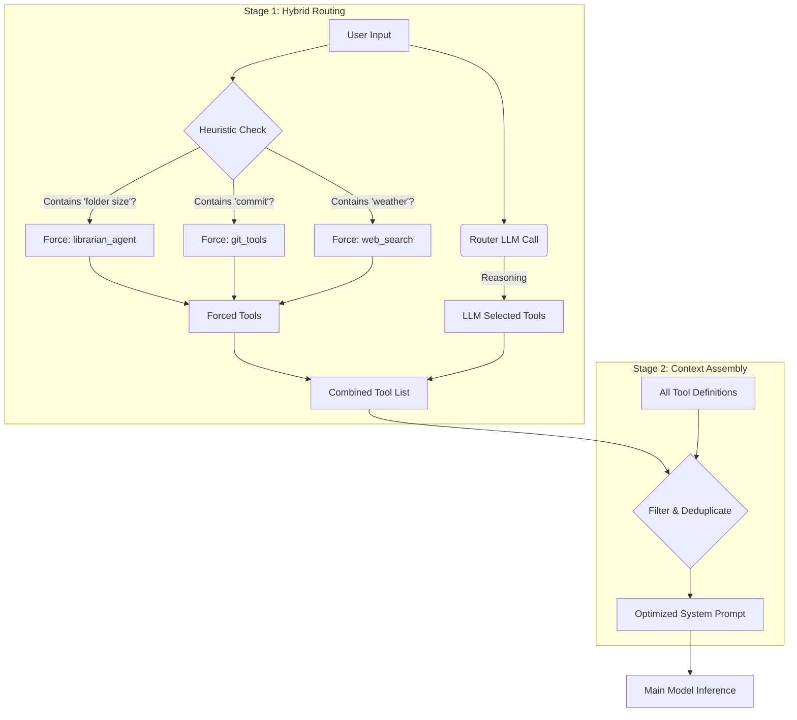

# Dynamic Tool Routing Architecture

This document details the **Dynamic Tool Router** and the three **Tool Calling 2.0** features of the Veyllo Agentic Framework (VAF). All features are **provider-agnostic** — they work with OpenAI, Anthropic, Google, local models, and OpenRouter without any provider-specific API extensions.

---

## 1. The Problem: Context Saturation

Modern agents often have access to dozens of tools (File System, Web Search, Git, Automation, Coding, etc.).

1. **Token Cost:** Defining a single tool in a JSON Schema (required for function calling) takes 150–500 tokens.
2. **Scale:** With 20+ tools, the definitions alone can consume 4,000+ tokens.
3. **Distraction:** Overloading the system prompt with irrelevant tools increases the chance of the model hallucinating tool calls or getting confused.

### The "Phantom Consumption"
Before the Router was implemented, the Agent had to reserve aggressive amounts of space for tools, often triggering "Proactive Compression" even when the conversation was short.

---

## 2. Tool Calling 2.0 — Three Provider-Agnostic Features

VAF implements all three concepts from Anthropic's "Advanced Tool Use" research, but in a **provider-agnostic** way so every backend benefits equally.

| Feature | Anthropic API variant | VAF provider-agnostic variant |
|---|---|---|
| **Tool Search** | `defer_loading: true` + tool search tool (beta) | Hybrid Router + `search_tools` tool |
| **Programmatic Tool Calling** | `code_execution` + `allowed_callers` (beta) | `python_sandbox(with_vaf_tools=True)` + `ToolBridgeServer` |
| **Tool Use Examples** | `input_examples` in tool JSON (beta) | `input_examples` embedded in description text |

---

## 3. Feature 1 — Tool Use Examples (`input_examples`)

### What it does
Every tool can optionally declare 1–3 concrete example calls. These are embedded as plain text into the tool's description so **every provider sees them** via the standard description field — no API change needed.

### How to add examples to a tool

```python
from vaf.tools.base import BaseTool

class MyTool(BaseTool):
    name = "my_tool"
    description = "Does something useful."
    input_examples = [
        {"query": "Berlin weather today"},
        {"query": "population of Tokyo", "language": "de"},
    ]
```

`BaseTool.get_description_with_examples()` renders this as:

```
Does something useful.

Examples:
  my_tool({"query": "Berlin weather today"})
  my_tool({"query": "population of Tokyo", "language": "de"})
```

### What the TOOLS property does with it

`agent.py`'s `TOOLS` property calls `get_description_with_examples()` instead of the raw `.description`. For small context windows (`n_ctx < 8000`) the truncation budget widens from 150 to 300 chars when examples are present so at least one example survives.

### Tools that already have examples

| Tool | Examples |
|---|---|
| `python_sandbox` | basic calc, `with_vaf_tools`, `packages` |
| `webfetch` | Python docs URL, GitHub repo |
| `send_mail` | plain email, email with attachment |
| `get_contact` | `name="Max"`, `name="Anna Müller"` |
| `search_tools` | calendar, whatsapp, read file |

To add examples to any other tool, just add the `input_examples` class attribute — no other changes needed.

---

## 4. Feature 2 — Tool Search (provider-agnostic)

### Hybrid Router (`_route_tools`)

VAF already solves the "load only relevant tools" problem without any Anthropic-specific API. The `_route_tools` method runs before every main model call:



**Heuristic keywords → forced tools:**

| Keywords | Forced tools |
|---|---|
| "folder size", "disk usage", "storage" | `librarian_agent` |
| "Google Drive", "OneDrive", "cloud" | `librarian_agent` |
| "calendar", "termin", "meeting", "event", "reminder" | `list_calendar_events`, `create_calendar_event` |
| "termin ändern", "reschedule" | `update_calendar_event` |
| "termin löschen", "cancel" | `delete_calendar_event` |
| "code", "script", "bug", "fix" | `coding_agent`, `git_status`, `git_add_commit` |
| "git", "commit", "push", "pull" | `git_status`, `git_add_commit`, `git_log` |
| "research", "recherche", "analyse" | `research_agent`, `web_search` |
| "search", "find", "news", "weather" | `web_search` |

### `search_tools` — on-demand discovery tool

In addition to the router, the model can itself call `search_tools` to discover tools it doesn't know about:

```
Model: search_tools(query="calendar appointment")
→ Returns:
    Tools matching 'calendar appointment':
      create_calendar_event: Create a new calendar event or appointment.
      list_calendar_events:  List upcoming events from the calendar.
      update_calendar_event: Modify an existing event.
```

**Scoring:** +2 per query token matching the tool name, +1 per token matching the description. Results capped at 10. If no matches, shows first 20 tools alphabetically with a "… and N more" trailer.

**Post-execution hook in `execute_tool()`:** After `search_tools` returns, the discovered tool names are immediately added to `_active_tools` so the model can call them in the very **next turn** without another router round-trip.

**Always available:** `search_tools` (and `list_tools`) are injected into every restricted tool set: the discovery-only fallback (router found no tools), CORE_TOOLS (tight context), and the emergency fallback list — so the model always has a discovery path.

### `_active_tools` state machine

| Value | Meaning |
|---|---|
| `None` | Use ALL registered tools (router failure / retry / internal step) |
| `[list]` | Use only these tool names (normal operation, post-router) |

---

## 5. Feature 3 — Programmatic Tool Calling (`with_vaf_tools=True`)

### Concept

The model calls one tool (`python_sandbox`) with a code block that internally calls multiple other VAF tools. Only the **final `print()` output** of the script returns to the model context. Intermediate tool results are consumed entirely inside the running script — they never become chat messages.

This matches Anthropic's "Programmatic Tool Calling" semantics and works with **every backend**.

### Usage

```python
python_sandbox(
    code="""
import vaf_tools

# Call any VAF tool — results stay inside the script
weather = vaf_tools.call("web_search", {"query": "Berlin weather"})
contact = vaf_tools.call("get_contact", {"name": "Max"})

# Only this line reaches the model context
print(f"Weather: {weather[:200]}\nContact: {contact}")
""",
    with_vaf_tools=True,
)
```

To see all callable tools from inside the script:
```python
import vaf_tools
print(vaf_tools.available())
```

### Architecture

```
Host (VAF process)                          Docker sandbox
──────────────────────────────────────────  ──────────────────────────────
ToolBridgeServer (random port, daemon)  ←── vaf_tools.call("web_search", …)
  token check (per-execution secret)         HTTP POST /call  (JSON)
  → agent.execute_tool("web_search", …)      ← JSON {"result": "..."}
  → return str result                        script continues with result
                                             …
                                             print("final answer")  → model
```

**Files:**
- `vaf/core/tool_bridge.py` — `ToolBridgeServer` + `_BridgeHandler` + stub source
- `vaf/tools/python_sandbox.py` — `with_vaf_tools` parameter + `_run_with_bridge()`

### Security

| Property | Detail |
|---|---|
| Token | `secrets.token_hex(16)` per execution — rejected on mismatch (HTTP 403) |
| Binding | `0.0.0.0` on host, random free port — not exposed beyond local network |
| Trust gates | All calls go through `agent.execute_tool()` — full VAF gate pipeline applies |
| Cleanup | `bridge.stop()` in `finally` block — no port leak even on crash |

### Host gateway resolution

| OS | Bridge address |
|---|---|
| Windows | `host.docker.internal` (Docker Desktop DNS) |
| macOS | `host.docker.internal` (Docker Desktop DNS) |
| Linux | `172.17.0.1` (Docker bridge gateway — LAN IP is NOT reachable from inside container) |

---

## 6. Context Consumption Analysis

### Without Router (legacy)
User: "What is the weather?"
- All 25+ tools in context → **~3,500–6,000 tokens**

### With Hybrid Router (current)
User: "What is the weather?"
1. Heuristic matches "weather" → forces `web_search`
2. Router LLM confirms `web_search`
3. Only `web_search` schema sent → **~200 tokens**

**Result:** >90% reduction in system prompt overhead.

---

## 7. Fallback Mechanisms

| Situation | Behaviour |
|---|---|
| Router LLM fails | `_active_tools = None` → ALL tools loaded (fail-safe) |
| Router returns empty | Context OK: discovery-only (`list_tools`, `search_tools`). Context tight (e.g. >75%): CORE_TOOLS subset. |
| Main model retry | `_active_tools = None` → full tool reload |
| Emergency (internal step) | Context >80%: minimal subset (`web_search`, `memory_search`, `list_tools`, `search_tools`, …) |

**CORE_TOOLS** (used when context is tight and router returns nothing):
`web_search`, `memory_search`, `memory_save`, `list_tools`, `search_tools`,
`update_intent`, `update_working_memory`, `read_file`, `list_files`,
`coding_agent`, `librarian_agent`, `research_agent`
