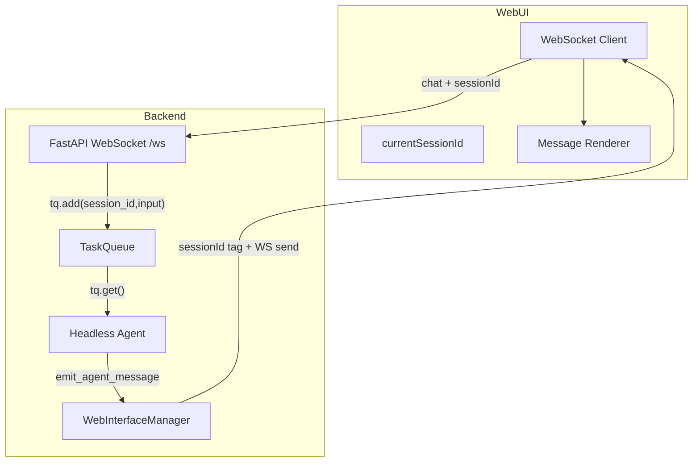

# WebUI WebSocket Flow & Debugging

This document explains how the WebUI connects to the backend over WebSocket, how session
scoping works, and how to debug missing responses. It is intended to prevent regressions
like "no answers shown in WebUI while CLI works."

## Architecture Overview

## Connection Sequence (Happy Path)

1. WebUI opens WebSocket: `ws://localhost:8001/ws`.
2. Backend sends `session_list` and then `history_update` (auto-load latest session).
3. Frontend sets `currentSessionId` and starts sending `chat` messages with session ID.
4. Backend queues the task.
5. Headless agent processes and streams `agent_message_update`.
6. Frontend renders the assistant response and the `<think>` block if present.

## Session Scoping Rules

All updates are scoped by `sessionId`. The frontend **must** keep `currentSessionId`
in sync with backend session updates; otherwise the frontend will filter out messages.

Key rules:
- `chat` must include `sessionId`.
- WebSocket responses are tagged with `sessionId`.
- Frontend ignores messages where `data.sessionId !== currentSessionId` (except
  `session_list` and `history_update`).

## Message Types

### Client → Server

- `chat`: user input (must include `sessionId`). Optional: `sidebarDocuments` (`Array<{ name, data, mimeType? }>`, same format as `set_sidebar_documents`); `editorDocument` (`{ name, content }`, plain text of Document Editor when open); `editorSelections` (`Array<{ start, end, text }>`, marked ranges in the editor for `replace_editor_selection`). If present, the backend stores sidebar docs in `session.runtime_state["sidebar_documents"]`, editor doc is prepended to the user turn as `--- CURRENT DOCUMENT (Editor): ... ---`, and editor selections in `session.runtime_state["editor_selections"]` for the tool.
- `set_sidebar_documents`: set documents shown in the Document Viewer (attachments panel) for the current session. Payload: `{ sessionId?, documents: Array<{ name, data (base64/data-URL), mimeType? }> }`. Backend stores extracted text in `session.runtime_state["sidebar_documents"]` and injects it into the next user turn for the LLM. Send `documents: []` to clear.
- `get_sessions`, `new_session`, `load_session`, `delete_session`
- `get_config`, `get_models`, `get_tools`, `get_workflows`
- **Automation planner (per-user):** `get_automation_notes`, `get_automation_todos` (no payload). Create/update/delete: `create_automation_note` (`title?`, `content`), `create_automation_todo` (`text`, `due_at?`), `update_automation_todo` (`id`, `text?`, `done?`, `due_at?`), `delete_automation_note` (`id`), `delete_automation_todo` (`id`). Server uses `user_scope_id` from the connection (same as `get_automations`).
- `get_notifications`: optional. Payload: `{ limit?: number }` (default 50). Server responds with `notifications_list` for the connection’s user.
- `contact_reply_decision`: approve or reject a pending contact reply (Front Office). Payload: `{ replyId: string, decision: "approve" | "reject" }`. Server responds with `contact_reply_result` (`ok`, `decision`, `replyId`, optional `error`).

### Server → Client

- `sidebar_documents_set`: sent after processing `set_sidebar_documents`. Payload: `{ contents: Array<{ name, content, data?, mimeType?, htmlContent? }>, sessionId?, error? }`. Each entry has `name` and `content` (extracted text for the LLM); `data` (base64) and `mimeType` for display. When Gotenberg is available, Office docs (.docx, .xlsx, .pptx, .odt, .ods, .odp) are converted to PDF on the backend and returned as `mimeType: application/pdf` with `data` (PDF base64), so the frontend uses the PDF viewer for original layout. Without Gotenberg, the backend provides `htmlContent` or the frontend falls back to client-side mammoth.js for DOCX.
- `editor_apply_edit`: sent when the agent calls `replace_editor_selection`. Payload: `{ sessionId, selectionIndex, newText, start, end }`. The frontend replaces the character range `[start, end]` in the Document Editor with `newText` and removes that selection chip.
- `session_list`: available sessions
- `history_update`: session history (also sets active session). The frontend does not clear document-panel attachment state for that session, so per-session attachment documents persist across repeated switches.
- `agent_message_update`: streaming assistant text (full content so far). The frontend shows a **separate** assistant bubble when the last message is a tool card: only the text after the previous assistant content is shown in the new bubble, so tool use and the follow-up answer appear distinctly.
- `clear_last_assistant`: request to remove the last assistant message (used before empty-response and false-promise retries so only the retry response is shown).
- `new_log`: system/status timeline entries. When the agent gives up after API empty-response delayed retries, it sends the final message only via `new_log` (return value `[SYSTEM_LOG_ONLY]...`); the headless runner does **not** send `agent_message_update` for that response, so the UI shows a system timeline entry only.
- `tool_update`: tool start/end/error
- `stats`: token/usage metrics
- `subagent_update`: sub-agent window payload
- `subagent_output`: final sub-agent output block
- `subagent_output_stream`: live stdout/stderr lines from headless sub-agents
- `model_state`: Status des lokalen Modells (`loaded`, `persistent`, `provider`)
- `config_saved`: Bestätigung nach Speichern der Einstellungen; bei Provider-Änderung enthält die Antwort `requires_refresh: true`, die Web-UI zeigt dann das Overlay „Changing model“ und lädt nach 5 Sekunden neu (siehe [MODELL_UND_PROVIDER_WECHSEL.md](MODELL_UND_PROVIDER_WECHSEL.md)).
- **Automation planner responses:** `automation_notes_list` (`notes: []`), `automation_todos_list` (`todos: []`); `create_automation_note_result` (`ok`, `note?`), `create_automation_todo_result` (`ok`, `todo?`), `update_automation_todo_result` (`ok`, `todo?`), `delete_automation_note_result` (`ok`, `id?`), `delete_automation_todo_result` (`ok`, `id?`). The frontend updates lists optimistically using returned `note`/`todo`/`id` when present.
- **Notifications:** `notification` — live push of a single notification (thinking run, automation result, or channel reply). Payload: `{ notification: { id, kind, title, status, timestamp, summary?, sessionId?, channel?, task_name?, run_id? } }`. `notifications_list` — response to `get_notifications`. Payload: `{ notifications: [] }`. Items are scoped to the user; the Notifications popup loads via `GET /api/notifications` or `get_notifications` and appends on `notification`.
- `contact_reply_pending`: a reply to a contact (Front Office) is waiting for approval. Payload: `{ replyId, source ("telegram"|"whatsapp"), contactName, preview, sessionId }`. The UI shows Approve/Reject; the client sends `contact_reply_decision` with the same `replyId` and `decision: "approve"` or `"reject"`.
- `contact_reply_result`: response to `contact_reply_decision`. Payload: `{ ok, decision?, replyId, error? }`. Used to remove the pending item from the UI or show an error.

## Troubleshooting Checklist

### 0) Log Locations (Debug Builds)

WebUI debug traces are written to the first writable location in this order:

1. `VAF_LOG_DIR` (if set)
2. `Platform.data_dir()/logs` (OS-specific app data dir)
3. `Platform.vaf_dir()/logs` (user home)
4. Repo `logs/` (dev fallback)

Useful files when debugging WebUI / LLM / queue (all under the log dir above):

| File | Contents |
|------|----------|
| `queue.log` | **QUEUE_ADD**, **QUEUE_GET**, **QUEUE_CHAT_START** / **QUEUE_CHAT_END**, **QUEUE_CHAT_FAIL**, **QUEUE_DONE** (session_id, cmd/compaction/chat) |
| `backend.log` | Backend per chat_step `[api(...)` / `server(8080)` / `library(...)]`, **503 model_loading retry**, **unavailable_after_retries**, **calling_8080**, **read_timeout no_data_300s** / **read_timeout_during_stream**, **\[CHUNK\]** / **\[CONTENT\]** (API stream) |
| `webui.log` | **\[WARNING\]** only when a message is dropped (no server loop). Stream/emit logging is disabled to avoid UI lag. |
| `rag.log` | RAG timing, search debug, embed calls, snippet count, user scope, failures |
| `memory.log` | **\[COMPACTION\]**, **\[USAGE\]** RSS, **\[EMBED\]** load, **\[PROFILER\]**, **\[WHISPER\]** (all timestamped) |
| `headless.log` | **\[STARTUP\]** Headless PID, log dir, Memory Profiler status |
| `prompt.log` | **\[SOUL\]** persona block, **\[SYSTEM_FULL\]** full prompt dump (multi-line) |

### 1) WebSocket Connected, But No Answer

**Expected logs in WebUI timeline:**
- `Queued input for session ...`
- `Processing task for session ...`
- `Starting chat_step for session ...`

If `Queued input...` is present but no further logs appear:
- **Headless agent is not consuming the queue.**
- Check `vaf/core/headless_runner.py` loop and ensure it uses `tq.get()` directly.

If `Starting chat_step...` appears but no response:
- **chat_step crashed or hung**.
- Check if the error mentions encoding (`charmap`); fix with UTF-8 output.
- For local backend: if `backend.log` shows `calling_8080 attempt=1` and nothing after, the server may have stopped sending data. The agent now applies a 5‑minute read timeout; after that it ends the step and the queue continues. Check `server.log` and machine load if timeouts repeat.

### 1b) Local Backend Not Reachable

If you see `LLM Call Failed: HTTPConnectionPool(127.0.0.1:8080)`:
- The local HTTP backend is not running or was stopped.
- Ensure the tray is running and the backend is reused instead of starting a second process.
- If multiple `llama-server.exe` instances appear, close all of them and restart the tray.

### 1c) 503 "Loading model" on first prompt / VQ1 no thinking / RAM 15–20 GB

- **503 on first prompt**: Headless now waits for `http://127.0.0.1:8080/v1/models` to return 200 (up to 2 min) before the first chat when using the server backend; the WebUI shows "Model is loading, please wait..." during that time.
- **VQ1 thinking**: Once the first request no longer hits 503, the server path streams `reasoning_content` (thinking) correctly. Tool calls emitted inside `<think>` are still parsed (agent searches `full_response` + `full_reasoning` for `<tool_call>...</tool_call>`); the system prompt instructs the model to place tool calls in the main response.
- **RAM spike (double model)**: On Windows, `force_server` defaults to **true** so the agent uses the HTTP backend (8080) only and does not load the library in-process. If the server block was skipped (e.g. server failed to start), the agent checks 8080 again before loading the library and reuses the server if reachable.

### 2) Messages Filtered on Frontend

If `agent_message_update` appears in WS frames but UI is empty:
- Check `currentSessionId` in `web/app/page.tsx`.
- Ensure `history_update` was received after connect.

### 3) No `agent_message_update` in WS Frames

If only `stats` or `new_log` arrives:
- The agent likely failed before streaming.
- Check for `Chat_step failed` log in the WebUI timeline.

### 3b) API Tool Calls Loop / “False promise detected”

When the agent detects a **false promise** (model claimed to use a tool in text but did not emit a tool call), it forces a retry and sends `clear_last_assistant` so the Web UI removes the faulty assistant message—same behaviour as empty-response retry. The user sees only the system notice and the retry response, not a duplicate bubble.

If responses loop with `False promise detected` without recovery:
- The API may be emitting tool-call chunks without a function name.
- The agent should drop invalid tool calls and fail fast instead of retrying.
- Check `backend.log` for `[CHUNK]` / `[CONTENT]` and `tool_calls` entries where `name` is missing.

### 4) Sub-Agent Panel Does Not Open

Expected triggers for the docked panel:
- `subagent_update` (preferred)
- `subagent_output` / `subagent_output_stream`
- `tool_update` with sub-agent tool name (e.g., `librarian_agent`)
- `new_log` with source/message containing "Sub-Agent"

If the tool card expands but the panel does not open:
- Confirm the WebSocket payloads include `sessionId` matching `currentSessionId`.

## Known Failure Modes and Fixes

| Symptom | Likely Cause | Fix |
|---|---|---|
| `Chat_step failed ... charmap` | Windows console encoding | Set `PYTHONIOENCODING=utf-8` and reconfigure stdout/stderr |
| `LLM Call Failed: HTTPConnectionPool(127.0.0.1:8080)` | Backend not running or duplicate server start | Restart tray; ensure only one `llama-server` is running |
| Chat stuck after `calling_8080` (no `QUEUE_CHAT_END`) | Local server stopped sending stream data | Agent now times out after 5 min and ends the step. If it keeps happening, check model load and RAM; see **Local Server: Request Timeouts** in `docs/API_INTEGRATION.md`. |
| Messages appear in CLI only | Headless agent not running | Ensure tray starts `run_headless_agent()` |
| WebUI shows only system logs | `agent_message_update` filtered by session | Fix session sync and auto-load `history_update` |
| Sub-agent window never appears | No `subagent_update` emitted | Send periodic sub-agent status updates from headless loop |
| `False promise detected` loop in API mode | Tool calls missing function name in stream | Drop invalid tool calls; do not retry |

## Key Files

- `vaf/core/web_server.py` (WebSocket server & routing)
- `vaf/core/web_interface.py` (broadcast manager)
- `vaf/core/headless_runner.py` (WebUI agent loop)
- `web/app/page.tsx` (frontend session filtering & render)

*Last updated: 2026-02-18*
