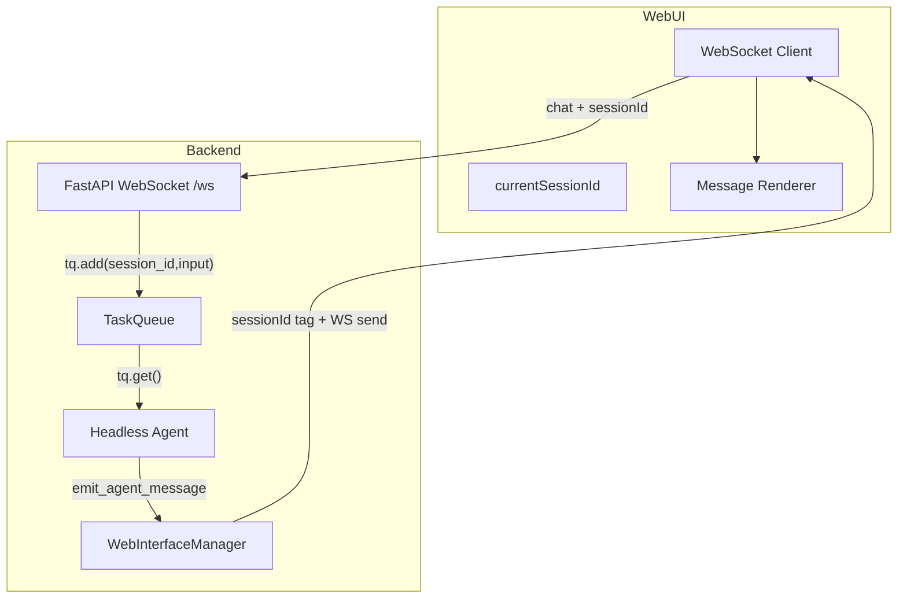

# WebUI WebSocket Flow & Debugging

This document explains how the WebUI connects to the backend over WebSocket, how session
scoping works, and how to debug missing responses. It is intended to prevent regressions
like "no answers shown in WebUI while CLI works."

## Architecture Overview

## Connection Sequence (Happy Path)

1. WebUI opens WebSocket: `ws://localhost:8001/ws`.
2. Backend sends `session_list` and then `history_update` (auto-load latest session).
3. Frontend sets `currentSessionId` and starts sending `chat` messages with session ID.
4. Backend queues the task.
5. Headless agent processes and streams `agent_message_update`.
6. Frontend renders the assistant response and the `<think>` block if present.

## Session Scoping Rules

All updates are scoped by `sessionId`. The frontend **must** keep `currentSessionId`
in sync with backend session updates; otherwise the frontend will filter out messages.

Key rules:
- `chat` must include `sessionId`.
- WebSocket responses are tagged with `sessionId`.
- Frontend ignores messages where `data.sessionId !== currentSessionId` (except
  `session_list` and `history_update`).

## Message Types

### Client → Server

- `chat`: user input (must include `sessionId`)
- `get_sessions`, `new_session`, `load_session`, `delete_session`
- `get_config`, `get_models`, `get_tools`, `get_workflows`

### Server → Client

- `session_list`: available sessions
- `history_update`: session history (also sets active session)
- `agent_message_update`: streaming assistant text
- `new_log`: system/status timeline entries
- `tool_update`: tool start/end/error
- `stats`: token/usage metrics
- `subagent_update`: sub-agent window payload

## Troubleshooting Checklist

### 1) WebSocket Connected, But No Answer

**Expected logs in WebUI timeline:**
- `Queued input for session ...`
- `Processing task for session ...`
- `Starting chat_step for session ...`

If `Queued input...` is present but no further logs appear:
- **Headless agent is not consuming the queue.**
- Check `vaf/core/headless_runner.py` loop and ensure it uses `tq.get()` directly.

If `Starting chat_step...` appears but no response:
- **chat_step crashed or hung**.
- Check if the error mentions encoding (`charmap`); fix with UTF-8 output.

### 2) Messages Filtered on Frontend

If `agent_message_update` appears in WS frames but UI is empty:
- Check `currentSessionId` in `web/app/page.tsx`.
- Ensure `history_update` was received after connect.

### 3) No `agent_message_update` in WS Frames

If only `stats` or `new_log` arrives:
- The agent likely failed before streaming.
- Check for `Chat_step failed` log in the WebUI timeline.

## Known Failure Modes and Fixes

| Symptom | Likely Cause | Fix |
|---|---|---|
| `Chat_step failed ... charmap` | Windows console encoding | Set `PYTHONIOENCODING=utf-8` and reconfigure stdout/stderr |
| Messages appear in CLI only | Headless agent not running | Ensure tray starts `run_headless_agent()` |
| WebUI shows only system logs | `agent_message_update` filtered by session | Fix session sync and auto-load `history_update` |
| Sub-agent window never appears | No `subagent_update` emitted | Send periodic sub-agent status updates from headless loop |

## Key Files

- `vaf/core/web_server.py` (WebSocket server & routing)
- `vaf/core/web_interface.py` (broadcast manager)
- `vaf/core/headless_runner.py` (WebUI agent loop)
- `web/app/page.tsx` (frontend session filtering & render)

*Last updated: 2026-01-29*
