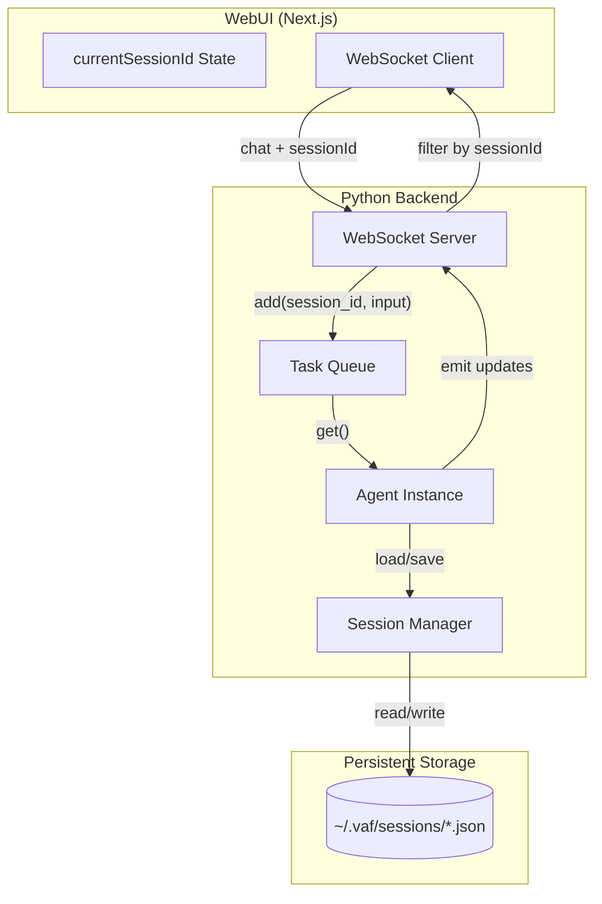

# VAF Session Management & Chat Synchronization

This document describes how VAF manages user sessions across TUI (Text UI), WebUI, and persistent storage.

---

## Architecture Overview



---

## Session ID Flow

### 1. Frontend → Backend (Sending Messages)

When user sends a chat message:

```typescript
// web/app/page.tsx (line 645-650)
ws.send(JSON.stringify({
    type: 'chat',
    content: textToSend,
    files: filesData,
    sessionId: currentSessionId  // CRITICAL: Must include session ID
}));
```

### 2. Backend Processing

```python
# vaf/core/web_server.py
# Priority: explicit message sessionId > connection sessionId > user-scoped fallback.
requested_session_id = cmd.get("sessionId")
connection_session_id = manager.get_session_for_connection(websocket)
session_id = requested_session_id or connection_session_id

# Safety: prevent implicit WebUI fallback into messenger sessions.
if (not requested_session_id) and isinstance(connection_session_id, str) and connection_session_id.startswith(("telegram_", "discord_", "whatsapp_")):
    session_id = None

if not session_id:
    safe_scope = str(manager.get_connection_user(websocket) or "default").replace("-", "")[:8]
    session_id = f"web-default-{safe_scope}"
```

### 3. Task Queue → Agent

For each task (chat or command), the runner calls `agent.load_session_context(task.session_id)` so the agent’s history and context match the task’s session. The queue now supports class-aware scheduling (`interactive`, `automation`, `background`) with optional weighted fairness; legacy single-queue behavior remains available by config. Example (conceptually):

```python
# vaf/core/headless_runner.py (chat task path)
task = tq.get()
agent.load_session_context(task.session_id)
# ... then process task.input_text (chat) or _handle_command (system command)
```

For channel-origin tasks (Telegram/WhatsApp/Discord), the queue task metadata is authoritative for user identity (`user_scope_id`, `username`, `role`). After loading session context, the runner re-applies these metadata fields to avoid stale session metadata overriding channel routing or user-scoped tools. The `username` and channel ids are re-applied unconditionally, but `user_scope_id` is now re-stamped onto the session only when the session has no scope yet — an already-owned session is never relabeled, so a queued chat cannot take it over (takeover hardening).

For channel-origin tasks, the runtime prompt context is additionally bounded to a recent history window (default: `15`, configurable via `channel_history_window_messages`):

- The window applies to **history elements** (e.g., `user`, `assistant`, and any replayed tool/system entries), not only user prompts.
- The effective in-memory prompt is `system prompt + last N elements` (when a system prompt exists at index 0).
- This is a sliding window: when a new element arrives, the oldest element in the window drops out.
- Older messages are **not deleted** from session storage; they remain in the session file for persistence/debugging.
- This window is independent from tool-loop protection. The separate two-stage tool-turn limit (soft at 50, hard at 75) controls recursion depth in one generation step, not session replay size.

When the session is loaded, `SessionManager.load(session_id, restore_state=True)` restores `runtime_state` (including ContextManager: intent, state, narrative summary) from the session file, so the agent has the correct high-level context for that session.

### 3b. Session switch (Web UI)

When the user clicks a different session in the Web UI, the frontend sends `load_session` with the session id. The server loads the session from disk, sends `history_update` to the client, and enqueues a system command:

- **Command:** `__CMD__:LOAD_SESSION:{sid}` (with `session_id="system"` so the queue accepts it).
- **Handler:** In `vaf/core/headless_runner.py`, `_handle_command()` handles `LOAD_SESSION` by parsing the session id from the command and calling `agent.load_session_context(sid)`.

As a result, the agent’s context (history + ContextManager) is switched to the selected session immediately, even if the user does not send a new message. The next message in that session then runs with the correct session context already loaded.

`load_session_context` also re-points the **per-session persistence store** (`Agent._bind_session_persistence`): the agent's intent, plan, tasks, notes, and team state live in `.vaf/main/sessions/<session_id>/`, so one chat's working memory never leaks into another (the legacy global `.vaf/main/` is the fallback when no session is known). See [CONTEXT_GLUE.md](CONTEXT_GLUE.md).

### 4. Agent → Frontend (Broadcasting Updates)

```python
# vaf/core/web_interface.py
def _push_session_update(self, session_id: str, data: dict):
    if session_id:
        data['sessionId'] = session_id  # Tag message with session
    # ... broadcast via WebSocket
```

### 5. User isolation (multi-user)

- **Session list:** The backend filters sessions by the connection's `user_scope_id` (`SessionManager.list(..., user_scope_id=...)`). Users only see their own sessions and legacy sessions (no scope).
- **Session-command ownership:** A single shared gate verifies ownership before the first side effect of every Web UI session command — chat (before subscribing), load, delete, rename, hide, and artifact edit. The session's `metadata.user_scope_id` must match the current user, or the connection must be admin (connection role `admin` or local-admin scope). A session with no recorded scope is treated as admin-only (unlike the session list, which still shows no-scope sessions to all users). On denial the server replies `Access denied` and keeps the connection open.
- **Default session:** When no session is selected, the fallback session ID is per-user (`web-default-<scope>`), not a single global `web-default`.

### 6. Initial Session Bootstrap

On WebSocket connect, the backend sends a **user-filtered** `session_list` and immediately follows with
`history_update` for the first session in that list (or a newly created session for that user if the list is empty). The frontend should set
`currentSessionId` from that update so that `agent_message_update` is not filtered out.


```typescript
// web/app/page.tsx (line 278-283)
if (data.sessionId && activeSessionId && data.sessionId !== activeSessionId) {
    if (data.type !== 'session_list' && data.type !== 'history_update') {
        return;  // Reject messages for other sessions
    }
}
```

---

## Session ID Sources

| Location | Variable | Purpose |
|----------|----------|---------|
| Frontend State | `currentSessionId` | Currently selected session in UI |
| Frontend Ref | `currentSessionIdRef` | Stable reference for WebSocket callbacks |
| WebSocket Message | `data.sessionId` | Backend-specified session for each message |
| Connection Manager | `manager.get_session_for_connection()` | Per-WebSocket connection mapping |
| Agent Instance | `agent._session_id` | Agent's current context session |
| Session Manager | `current_session.id` | Active session being processed |

---

## Common Issues & Solutions

### Issue: WebUI Shows No Response

**Symptom:** TUI displays response, WebUI empty.

**Cause:** Session ID mismatch between frontend and backend.

**Fix:** Ensure frontend sends `sessionId` with every chat message.

---

### Issue: Messages Go to Wrong Session

**Symptom:** Response appears in different session than expected.

**Cause:** `agent._session_id` not synced after task queue processing.

**Fix:** After loading task from queue, sync agent session ID:
```python
agent._session_id = current_session.id
agent._register_session()
```

---

### Issue: Telegram Uses Wrong User Context (stale data/date/email list)

**Symptom:** Web UI answers are current, but Telegram answers look stale (old date references, old inbox view, wrong user scope behavior).

**Cause:** The channel session file can contain legacy metadata from an older identity mapping. If this stale metadata is applied during session load, it can temporarily override the intended channel user mapping.

**Current Behavior / Fix:** In the headless queue path, channel task metadata is re-applied immediately after `load_session_context(...)`, so queued channel tasks keep the correct user identity. This prevents stale session metadata from overriding Telegram/WhatsApp/Discord task routing.

**Related behavior:** Channel sessions also use a bounded recent-history window for prompt construction, so stale long-tail chat entries are less likely to be reused instead of triggering fresh tool calls.

---

### Issue: Session Not Found

**Symptom:** Error loading session from storage.

**Cause:** WebUI created new session ID that doesn't exist in `~/.vaf/sessions/`.

**Fix:** Create session on-the-fly if not found:
```python
try:
    current_session = session_mgr.load(task.session_id)
except:
    current_session = session_mgr.new()
    current_session.id = task.session_id
    session_mgr.save(current_session)
```

---

## Session Storage Format

Sessions are stored as JSON in `~/.vaf/sessions/<session_id>.json`:

```json
{
    "id": "blue464411",
    "name": "Session 2026-01-27 05:30",
    "created_at": "2026-01-27T05:30:00.000Z",
    "updated_at": "2026-01-27T05:45:00.000Z",
    "model": "gpt-4o",
    "project_path": "/home/user/Documents/VAF_Projects/My Website",
    "messages": [
        {"role": "user", "content": "Hey", "timestamp": "..."},
        {"role": "assistant", "content": "Hello!", "timestamp": "..."}
    ],
    "runtime_state": {
        "last_project_path": "/home/user/Documents/VAF_Projects/My Website"
    }
}
```

### Per-turn persistence: tool calls & context summary

Besides plain `user`/`assistant` text, each turn also persists what the agent *did*, so it stays aware of its own tool calls and their errors across reloads:

- The `Message` model carries optional `tool_calls` (on assistant messages) and `tool_call_id` + `name` (on `role: "tool"` results). These are written to disk and restored on load, preserving valid `tool_use`/`tool_result` pairs (`load_session_context` keeps the linkage and no longer drops a tool-call assistant message just because its visible text is empty).
- After the turn-end squash (see [CONTEXT_MANAGEMENT.md](CONTEXT_MANAGEMENT.md) — *Per-Turn Intermediate-Step Squash*), the raw tool scaffolding is usually replaced by a single `role: "system"` summary that starts with `[Context: …]` and lists each tool's outcome (`OK`/`FAILED` + a short snippet). That summary is persisted and, unlike other operational system messages, is **kept** on reload (it is exempt from the system-message ignore filter).

Example of a tool turn as stored:

```json
{"role": "user", "content": "Transcribe this video: https://…"},
{"role": "system", "content": "[Context: tools used this turn]\n- python_exec → FAILED: Object of type PosixPath is not JSON serializable\n- browser_agent → OK: no transcript/captions found"},
{"role": "assistant", "content": "No transcript available…"}
```

### Session Workspace (`project_path`)

`project_path` is the **stable workspace root** for a chat session. It is set automatically on the first `file_created` event for that session (in `vaf/core/web_server.py`) and never overwritten afterward. This gives the session a permanent home directory even if the user creates multiple projects within the same chat.

Rules:
- Only set for paths inside `~/Documents/VAF_Projects/` — temporary files and one-off outputs are excluded.
- New projects are created per chat: `VAF_Projects/<uid[:8]>/<session_id>/<ProjectName>` (the session level applies whenever a session id is available).
- `runtime_state["last_project_path"]` continues to track the **most recently created or edited** project and is updated on every `file_created` event — except for unsafe directories (home dir, `~/.vaf`, ...), which are never recorded or re-injected (`is_unsafe_project_dir` guard; legacy sessions holding such paths are corrected automatically on load).
- **Image attachments** uploaded in a chat are stored as files under `VAF_Projects/<uid[:8]>/<session_id>/attachments/` (`get_session_attachments_dir()`); `Message.metadata["images"]` holds only `{name, mime_type, path, base_description}`, not inline base64. The agent reads them by path (`analyze_image` / `read_file`); the Web UI serves them via `GET /api/file`. See the vision section in `docs/llm/API_INTEGRATION.md`.

At the start of each agent turn, `vaf/core/headless_runner.py` injects both values into the effective input:

```
[SESSION WORKSPACE] All files for this chat are stored in: /home/user/Documents/VAF_Projects/My Website
[ACTIVE PROJECT] Most recently created/edited: /home/user/Documents/VAF_Projects/My Website
To edit or modify: coding_agent(task="...", project_path="...")
```

Sessions created before this feature was introduced have `project_path = ""` and fall back to the older `[PROJECT CONTEXT]` injection format so backward compatibility is maintained.
```

---

## Debugging Session Issues

Enable debug logging:

```python
# vaf/core/web_interface.py (line 208)
print(f"[WebUI] Update: {data.get('type')} (sess: {session_id})")
```

```typescript
// web/app/page.tsx (line 280)
console.log(`[FILTER] Rejecting ${data.type}: backend=${data.sessionId}, frontend=${activeSessionId}`);
```

---

## Key Files

| File | Responsibility |
|------|----------------|
| `vaf/core/session.py` | Session data model, SessionManager class |
| `vaf/core/web_server.py` | WebSocket server, message routing |
| `vaf/core/web_interface.py` | Agent → WebUI broadcast manager |
| `vaf/cli/cmd/run.py` | CLI loop, task queue processing |
| `vaf/core/task_queue.py` | Queue policy, fairness, per-session in-flight guard |
| `web/app/page.tsx` | Frontend state, session filtering |

---

*Last updated: 2026-06-02*
